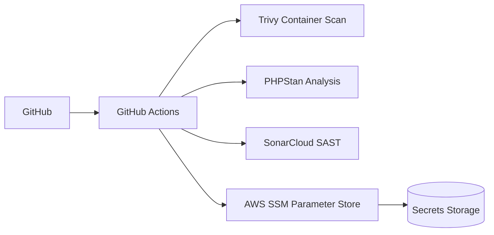

# Day 7 - Quality & Security Infrastructure

## Overview

This module provides infrastructure-as-code for quality and security scanning tools:
- **SSM Parameter Store** for secure secrets management (AWS free tier)
- **IAM policies** with least-privilege access for CI/CD
- **GitHub Actions** workflows for:
  - Trivy (container scanning)
  - PHPStan (PHP static analysis)
  - SonarCloud (static analysis - free tier)

## Architecture



## Prerequisites

1. AWS CLI configured
2. Terraform >= 1.5.0
3. GitHub repository with secrets configured

## Quick Start

### 1. Configure Terraform

```bash
cd terraform
cp terraform.tfvars.example terraform.tfvars
# Edit terraform.tfvars with your values
```

### 2. Deploy Infrastructure

```bash
cd terraform
terraform init
terraform plan
terraform apply
```

### 3. Configure GitHub Secrets

Add these secrets to your GitHub repository:

- `AWS_ACCESS_KEY_ID` - IAM user access key
- `AWS_SECRET_ACCESS_KEY` - IAM user secret key
- `SONAR_TOKEN` - SonarCloud API token

### 4. Add GitHub Actions Workflow

Copy `.github/workflows/quality-security-ci.yml` to your repository.

## Cost Optimization

| Service | Free Tier | Cost after free tier |
|---------|-----------|---------------------|
| SSM Parameter Store | 10,000 parameters/month | $0.05 per 10,000 parameters |
| AWS KMS | 20,000 requests/month | $0.03 per 10,000 requests |
| GitHub Actions | 2,000 minutes/month | Varies by OS |
| SonarCloud | Unlimited (open source) | N/A |

## Security Best Practices

### Least-Privilege IAM Policy

The IAM policies are scoped to:
- Specific SSM parameter paths
- Read-only access by default
- Read-write only for CI/CD role

### Secrets Management

1. Use **SSM Parameter Store** with `SecureString` type
2. Enable KMS encryption (AWS-managed key)
3. Never log secrets in CI/CD
4. Rotate credentials regularly

### CI/CD Security

1. Use GitHub OIDC for AWS authentication
2. Set short-lived credentials
3. Fail builds on critical vulnerabilities
4. Use secret scanning before commits

## File Structure

```
day07/
├── terraform/
│   ├── main.tf              # Provider configuration
│   ├── variables.tf         # Input variables
│   ├── locals.tf            # Local values
│   ├── ssm.tf              # SSM parameters
│   ├── iam.tf              # IAM policies & roles
│   ├── outputs.tf          # Output values
│   ├── provider.tf         # Provider settings
│   └── terraform.tfvars.example
└── github-actions/
    └── quality-security-ci.yml
```

## SSM Parameter Paths

Parameters are organized by environment:

```
/{project}/{environment}/
  ├── database/
  │   ├── host
  │   ├── port
  │   ├── username
  │   └── password
  ├── api/
  │   └── key
  ├── cache/
  │   └── endpoint
  └── app/
      └── config
```

## GitHub Actions Workflow

The workflow runs:

1. **PHP Static Analysis** - PHPStan
2. **SonarCloud Analysis** - Static code analysis
3. **Container Security Scan** - Trivy
4. **SSM Configuration** - Retrieve secrets
5. **Quality Gate** - Verify all checks pass

## Cleanup

```bash
# Destroy Terraform resources
cd terraform
terraform destroy

# Delete SonarCloud project (manual)
# Visit sonarcloud.io and delete the project
```

## Troubleshooting

### SSM Parameter Access Denied

Check IAM policy:
```bash
aws iam get-policy-version --policy-arn <policy-arn> --version-id v1
```

### Trivy Scan Fails

- Ensure Docker is running
- Check image exists and is tagged correctly
- Verify severity settings

### SonarCloud Quality Gate Fails

- Review SonarCloud dashboard
- Fix code quality issues
- Adjust quality gate thresholds
